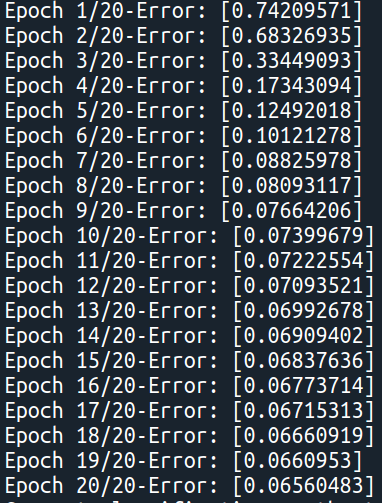
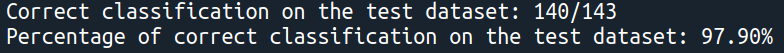

# Artificial Neural Network from scratch

## Table of contents
* [Introduction](#Introduction)
* [Technologies](#Technologies)
* [How to install](#How-to-install)
* [How to use](#How-to-use)
* [Source](#Source)

## Introduction
The aim of this project is to program an Artificial Neural Network from scratch, by using only Numpy. For this reason it is taught as a training project, in order to deeply understand how an Artificial Neural Network works from both a mathematical and computational point of view.\
### Structure of the repository
The principal component of this repository is the ann.py file, where the Ann class is implemented. It is supported by activation_functions.py and loss_functions.py, where the possible activation functions and loss functions are respectively implemented. In addiction, in the file testing.py there is the testing routine based on the library Hypothesis. Finally, there are three scripts (binary_classification.py, classification_Iris.py and classification_Digits.py) that are examples on how to perform binary classification and multiple-class classification. 

## Technologies
Project is created with: 
* Python 3.8
* Numpy 1.21.2
* Sklearn 0.24.1
* Pickle 4.0
* Hypothesis 6.29.3

## How to install
To install the repository run:
```
$ git clone https://github.com/filipposchiazza/Neural-Network-Project.git
```
It is also possible to install all or some of the required packages, by running:
```
$ pip install requirements.txt
```

## How to use
First of all, import the library:
```
$ import ann
$ import activation_functions as act
$ import loss_functions as lf
```
Create the neural network:
```
$ my_neural_network = ann.Ann(64, [15], 10)
```
where you provide the number of inputs (64), the number of hidden layers with the number of neuron for each of them ([15] means 15 neurons and one hidden layer) and the number of outputs (10). Remember that the number of inputs must be equal to the dimensionality of the dataset and the number of outputs must be equal to the number of classes (in case of multiple-class classification) or to one (in case of binary classification).
Now, you should split the dataset and the respective labels in two parts: train and test.  

Train the neural network with the test dataset and targets
```
$ my_neural_network.train(data_train, targets_train, epochs=30, learning_rate=0.1, activation_function=act.softmax, loss_func=lf.cross_entropy)
```
\
Evaluate the performance of the neural network in the classification
```
$ my_neural_network.evaluate_classification(data_test, targets_test)
```
\
At this point it is possible to save the parameters of the neural network (weights, biases, number of neurons for each layers, the activation and the loss function) in pkl format
```
$ my_neural_network.save_parameters(file_name="parameters.pkl")
```
For a future use, it is possible to create a neural network with the parameters stored in the pkl file
```
$ network_loaded = Ann.load_and_set_network("parameters.pkl")
```

## Source
The general ideas on the structure, the forward and backward propagation are inspired by https://www.youtube.com/watch?v=Z97XGNUUx9o&t=1679s
