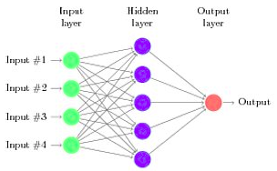

# Artificial Neural Network from scratch
The aim of this project is to program an Artificial Neural Network from scratch, based only on the Numpy library. For this reason the project is taught as a training project, in order to deeply understand how a Feed Forward Neural Network works from both a mathematical and computational point of view.

## Table of contents
* [Introduction](#Introduction)
  * [Structure of the repository](#Structure-of-the-repository)
* [Technologies](#Technologies)
* [How to install](#How-to-install)
* [How to use](#How-to-use)
  * [Import the modules](#Import-the-modules)
  * [Data pre-processing](#Data-pre-processing)
  * [Neural Network building](#Neural-Network-building)
  * [Neural Network training](#Neural-Network-training)
  * [Classification evaluation](#Classification-evaluation)
  * [Saving parameters and loading the network](#Saving-parameters-and-loading-the-network)
* [Testing](#Testing)
* [Scripts](#Scripts)

## Introduction
An Artificial Neural Network is inspired by the human brain's neurons structure and it can be used both for classification and regression tasks. It is a supervised learning technique, so this means that a dataset with labels is required. The core of an Artificial Neural Network is represented by the *forward propagation*, where the signal moves from the input layer towards the output layer and the *backpropagation*, where the network's weights are updated in order to minimize the so-called *Loss function* (a function that measure how far is the network's prediction from the target). 


### Structure of the repository
The repository is structured in the following way:
* **neuralnet/**
  - **ann.py** : implementation of the Ann class. The neural network is built starting from five parameters: int (number of neurons in the input layer), list (each element *i* of the list represent the number of neurons in the *i-th* hidden layer, so this means that the list's lenght corresponds to the number of hidden layers), int (number of output layers), the activation and the loss functions. In the training method the stochastic gradient descendent algorithm is implemented, so there is a weights updating for each input.
  - **activation_functions.py** : implementation of the activation functions and of their derivatives (sigmoid and softmax)
  - **loss_functions.py** : implementation of the loss functions and of their derivatives (binary cross entropy and categorical cross entropy)
* **test/**  implementation of the testing routine, based on the library Hypothesis
  - **test_ann.py** : test routine on the class Ann
  - **test_activation_function.py** : test routine on the activation functions and their derivatives
  - **test_loss_function.py** : test routine on the loss functions and their derivatives
* **scripts/** : collection of example scripts both for binary and multi-class classification
  - **binary_classification.py**
  - **classification_Iris.py**
  - **classification_Digits.py**
 * **requirements.txt** : dependencies
 * **README.md**
 * **images/** : images used in the README.md file

## Technologies
Project is created with: 
* Python 3.8
* Numpy 1.21.2    : core base of the class Ann and the activation and loss functions
* Sklearn 0.24.1    : used in the example scripts, for loading the datasets and pre-processing data
* Hypothesis 6.29.3   : for the implementation of the testing routine

## How to install
Move to the directory where you want to install the repository:
```
$ cd /directory/where/install/repository/
```
To install the repository run:
```
$ git clone https://github.com/filipposchiazza/NeuralNetworkFromScratch.git
```
Move in the installed directory:
```
$ cd NeuralNetworkFromScratch/
```
Use the setup.py file to install the package:
```
$ python setup.py install
```

## How to use
### Import the modules
First of all, import the modules:
```python
from neuralnet import ann
from neuralnet import activation_functions as act
from neuralnet import loss_functions as lf
```

### Data pre-processing
It is better to perform normalization/standardization on the inputs:
```python
from sklearn.preprocessing import MinMaxScaler

scaling = MinMaxScaler()
data = scaling.fit_transform(data)
```
Divide the dataset and the targets in two portion, train and test:
```python
data_train, data_test, targets_train, targets_test = train_test_split(data, targets, test_size=0.3) # here the splitting is train 70% - test 30%
```
Remark: the targets should be zeros ore ones in the case of binary classification and array of zeros and ones in the case of multi-class classification.


### Neural Network building
Create the neural network:
```python
my_neural_network = ann.Ann(num_inputs=64, num_hidden=[15], num_outputs=10, activation_function=act.softmax, loss_function=lf.cross_entropy)
```
where you provide the number of inputs (64), the number of hidden layers with the number of neuron for each of them ([15] means 15 neurons and one hidden layer), the number of outputs (10), the activation function (softmax) and the loss function (cross_entropy). Remember that the number of inputs must be equal to the dimensionality of the dataset and the number of outputs must be equal to the number of classes (in case of multiple-class classification) or to one (in case of binary classification).

### Neural Network training
Train the neural network with the training dataset and targets. You have to specify the number of epochs (how many times the entire train dataset is presented to the network) and the learning rate (how fast the algorithm goes down in the opposite direction of the gradient in the gradient descendent).
```python
my_neural_network.train(inputs=data_train, targets=targets_train, epochs=30, learning_rate=0.1)
```
\
It is possible to avoid the printing of the error for each epoch by passing the parameter```verbose=False``` to the train method. 

### Classification evaluation
Evaluate the performance of the neural network in the classification, by using the test dataset:
```python
my_neural_network.evaluate_classification(inputs=data_test, targets=targets_test)
```
\

### Saving parameters and loading the network
At this point it is possible to save the parameters of the neural network (weights, biases, number of neurons for each layers, the activation and the loss function) in *json* format
```python
my_neural_network.save(directory_name="network_parameters/")
```
For future predictions, you can create a neural network with the parameters stored in json format in the directory previously created ("network_parameters/")
```python
network_loaded = Ann.load_neural_network(directory_name="network_parameters/")
```

## Testing
A Testing routine is implemented, by using the Hypothesis library. It is possible to run the test routine with *pytest*. If it is not alrey installed, run:
```
$ pip install pytest
```
Move to the directory NeuralNetworkFromScratch:
```
$ cd path/to/NeuralNetworkFromScratch
```
Run the testing routines:
```
$ pytest test/
```
it will run all the three test files: test_ann.py, test_activation_function.py, test_loss_function.py.

# Scripts
Three example scripts are provided (one for binary classification and two for multi-class classification).
To run them, move to the directory scripts/
```
$ cd NeuralNetworkFromScratch/scripts/
```
and run:
```
$ python binary_classification.py
$ python classification_Iris.py
$ python classification_Digits.py
```
